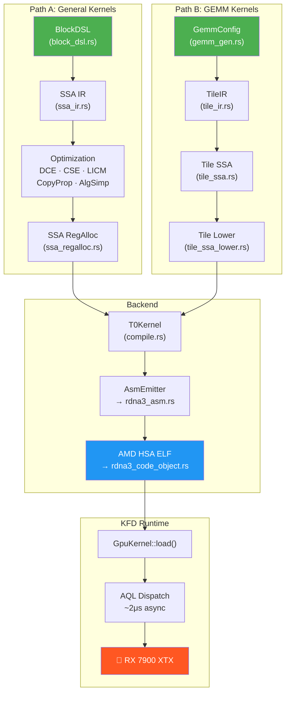

# T0-GPU

**RDNA3 裸金属 GPU 内核编译器 & KFD 运行时**
**Bare-Metal GPU Kernel Compiler & KFD Runtime for RDNA3**

---

## 概述 / Overview

T0-GPU 是一个纯 Rust 实现的 GPU 编程框架，直接面向 AMD RDNA3 (GFX1100) 硬件。它完全绕过 HIP/ROCm 用户态库，通过 Linux KFD 驱动接口与 GPU 直接通信。**~50,000 行 Rust 代码，零外部依赖。**

T0-GPU is a pure-Rust GPU programming framework targeting AMD RDNA3 (GFX1100) hardware. It bypasses HIP/ROCm userspace libraries entirely, communicating directly with the GPU through the Linux KFD driver interface. **~50,000 lines of Rust, zero external dependencies.**

### 核心组件 / Core Components

| 组件 / Component | 说明 / Description |
|---|---|
| **T0 编译器 / Compiler** | DSL → SSA IR → 6-pass 优化 → 寄存器分配 → GFX1100 ISA → AMD HSA ELF |
| **GEMM 生成器 / GEMM Generator** | 参数化 bf16 WMMA GEMM：cooperative load + LDS double-buffer + K-loop 流水线 |
| **ISA 编码器 / ISA Encoder** | GFX1100 全指令集机器码编码（VOP1/VOP2/VOP3/SMEM/FLAT/WMMA/DS/MUBUF） |
| **Code Object 生成器** | 手工构建 AMD HSA ELF 二进制（不依赖 LLVM linker） |
| **KFD 运行时 / Runtime** | 裸金属 GPU 调度：AQL 队列、VRAM 管理、doorbell dispatch (~2μs) |

## 🏆 性能亮点 / Performance Highlights

> **GEMM 89.1 TFLOPS** — 128×128 k64 WGP 配置，4096³ bf16 矩阵乘法，RX 7900 XTX 实测，**达到 rocBLAS 的 98%**。
> **89.1 TFLOPS** on 128×128 k64 WGP config, 4096³ bf16 GEMM on RX 7900 XTX — **98% of rocBLAS performance**.

> **🏆 7/9 矩阵尺寸超越 rocBLAS**，最高领先 **97%**，峰值 **89.1 TFLOPS**。
> **Beats rocBLAS on 7 out of 9 matrix sizes**, by up to **97%**, peaking at **89.1 TFLOPS**.

> **Zero-Overhead Dispatch** — 异步调度延迟 **2.26 μs**（HIP: 2.6 μs），同步调度 **14.96 μs**（HIP: 20.5 μs）。
> Async dispatch **2.26 μs** (HIP: 2.6 μs), sync dispatch **14.96 μs** (HIP: 20.5 μs) — **13-27% faster** than HIP.

> **Zero-Dependency** — 纯 Rust，**零外部依赖**，仅需 `/dev/kfd` + `/dev/dri`。
> Pure Rust, **zero external dependencies** — only requires `/dev/kfd` + `/dev/dri`.

## 为什么不用 HIP？/ Why Not HIP?

| | HIP Runtime | KFD 裸金属 / Bare-Metal |
|---|---|---|
| **同步调度延迟 / Sync dispatch** | 20.5 μs | **14.96 μs** (−27%) |
| **异步调度延迟 / Async dispatch** | 2.6 μs | **2.26 μs** (−13%) |
| **内存管理 / Memory mgmt** | hipMalloc/hipFree | 直接 mmap VRAM / Direct VRAM mmap |
| **依赖 / Dependencies** | libhip, libhsakmt, ROCr | 仅 `/dev/kfd` + `/dev/dri` |
| **编译器栈 / Compiler stack** | Python + LLVM + ROCm (数 GB) | 单一 Rust binary |

## 快速开始 / Quick Start

### 环境要求 / Requirements

- **GPU**: AMD RDNA3 (RX 7900 XTX / 7900 XT / 7800 XT 等)
- **OS**: Linux, 内核 5.15+（Ubuntu 22.04+ 推荐）/ Linux kernel 5.15+
- **驱动 / Driver**: amdgpu KFD（内核模块自带，无需额外安装）/ Built-in kernel module
- **工具链 / Toolchain**: Rust 1.70+, LLVM 17+ (`llvm-mc`, `ld.lld`)

#### 验证环境 / Verify Setup

```bash
# 检查 KFD 设备
ls -la /dev/kfd /dev/dri/renderD128

# 检查用户权限
groups | grep -E "video|render"
# 如需添加: sudo usermod -aG video,render $USER && newgrp video

# 验证 LLVM
llvm-mc --version    # 需要 17+
```

### 编译 / Build

```bash
# 仅编译 T0 编译器（无需 GPU）
cargo build --release --lib

# 编译含 KFD 运行时
cargo build --release --lib --features rocm

# 运行 GEMM 基准测试（见下方「性能复现」章节）
cargo test --release --features rocm -- test_wgp_k64_benchmark \
  --nocapture --ignored --test-threads=1

# 运行正确性测试
cargo test --release --features rocm -- test_tile_ir_correctness \
  --nocapture --test-threads=1

# 导出 ISA 汇编（调试）
T0_DUMP_ASM=1 cargo test --release --features rocm -- <test_name>
```

### 示例：BlockDSL API / Example: BlockDSL API

```rust
use t0_gpu::t0::block_dsl::*;

// 矢量加法内核 / Vector add kernel
let mut kb = BlockKernel::new("vadd", 256);
let x = kb.arg_ptr("x");
let y = kb.arg_ptr("y");
let n = kb.arg_u32("n_elems");
let gid = kb.global_id();

kb.if_lt(gid, n, |kb| {
    let a = kb.load_f32(x, gid);
    let b = kb.load_f32(y, gid);
    let c = kb.add(a, b);
    kb.store_f32(x, gid, c);
});

let compiled = kb.compile(Target::GFX1100)?;
// → AMD HSA ELF binary, ready for KFD dispatch
```

---

## T0 编译器架构 / T0 Compiler Architecture

T0 是一个多层 GPU 内核编译器，具有两条独立的编译路径：

T0 is a multi-layer GPU kernel compiler with two independent compilation paths:



### Path A: BlockDSL → SSA (通用内核 / General Kernels)

适用于逐元素运算、Softmax、RoPE、Cross-Entropy Loss 等。

For elementwise ops, Softmax, RoPE, Cross-Entropy Loss, etc.

- **BlockDSL**: Triton 风格的声明式内核 DSL（循环、条件、LDS、WMMA、Wave reduce）
- **SSA IR**: Static Single Assignment 中间表示 + Phi 节点 + 控制流图
- **6-Pass 优化**: DCE、CSE (barrier-aware)、LICM、Copy Propagation、Algebraic Simplification、Waitcnt Refinement
- **SSA RegAlloc**: 线性扫描 + Gap Reclaim + WMMA 8-aligned 群组分配

### Path B: TileIR → GEMM (矩阵乘法专用 / GEMM-Specific)

适用于 bf16 WMMA 矩阵乘法。

For bf16 WMMA matrix multiplication.

- **GemmConfig**: 参数化配置（tile_m/n/k, split_k, wg_size, transpose）
- **TileIR**: K-loop 双缓冲流水线 + Cooperative Load + Graduated LDS Waits
- **Tile SSA**: VGPR 压力估算 + acc_swap 检测
- **Auto-Select**: `auto_select(M, K, N)` 自动选择最优配置

### 内置内核 / Built-in Kernels

| 内核 / Kernel | 说明 / Description |
|---|---|
| **GEMM** | bf16 WMMA, cooperative load, LDS double-buffer, auto-select |
| **RMSNorm** | 前向 + 后向 / Forward + backward |
| **Softmax** | Online Safe Softmax (数值稳定) |
| **Cross-Entropy** | log_softmax + NLL loss + backward |
| **RoPE** | 旋转位置编码 前向 + 后向 |
| **Causal Mask** | 上三角 mask → -inf |
| **Elementwise** | scale, relu, sigmoid, SiLU, gelu, exp, fma 及融合组合 |
| **Transpose** | f32/bf16 矩阵转置 |
| **Format** | f32 ⇆ bf16 转换 |

---

## 🏆 GEMM 性能实测 / GEMM Performance

### T0 TileIR GEMM (2026-03-30)

4096×4096×4096 bf16 矩阵乘法，RX 7900 XTX 实测：

4096³ bf16 GEMM on RX 7900 XTX:

| 配置 / Config | VGPRs | Waves/SIMD | 4096³ TFLOPS | vs rocBLAS |
|---|:---:|:---:|:---:|:---:|
| **128×128 k64 WGP** | **176** | 4 | **89.1** | **🏆 98%** |
| **128×128 k32 WGP** | **216** | 2 | **88.7** | **🏆 98%** |
| 128×128 k64 CU | 184 | 4 | 87.6 | 97% |
| 128×128 k32 CU | 216 | 2 | 87.2 | 96% |

> rocBLAS 基线 / rocBLAS baseline: ~90.78 TFLOPS (PyTorch 2.9.1+rocm6.4, `torch.mm()` bf16)

### 性能演化 / Performance Evolution

| 日期 / Date | 版本 / Version | 4096³ TFLOPS | 关键优化 / Key Optimization |
|---|---|:---:|---|
| 2026-03-21 | gemm_gen Split-K | 67.3 | Split-K + WGP mode |
| 2026-03-29 | TileIR v1 | 79.2 | Graduated lgkmcnt + Gap Reclaim |
| 2026-03-30 | TileIR v2 (Phase 1) | 84.1 | soffset addressing |
| 2026-03-30 | TileIR v2 (Phase 2) | 89.0 | LDS offset folding |
| **2026-03-30** | **TileIR v2 (Phase 3)** | **89.1** | **Concurrent VMEM overlap** |

### 优化技术 / Optimization Techniques

| 技术 / Technique | 说明 / Description |
|---|---|
| **Cooperative Loading** | 工作组内线程协作加载 tile，每线程 buffer_load_b128 (16B) |
| **LDS Double Buffering** | 双缓冲 K-loop 流水线，隐藏 GMEM 延迟 |
| **Graduated LDS Waits** | ds_load 后逐条 lgkmcnt(N) 精化，最大化 WMMA/LDS 重叠 |
| **soffset Addressing** | SGPR 行偏移预计算 → 消除 inner loop 串行 v_add 链 |
| **LDS Offset Folding** | ds_store 立即数 offset 字段折叠行地址，零 VGPR 开销 |
| **Concurrent VMEM** | X 和 WT 矩阵同时发射 buffer_load，92+ 指令 VMEM 重叠窗口 |
| **Gap Reclaim** | 对齐间隙 VGPR 回收，节省 ~15 VGPRs |
| **Auto-Select + K-Clamp** | 自动选最优 tile 配置 + 保证 K 可整除 |
| **Split-K** | 编译时 K 维并行化 (sk=1~16) |
| **Dual Grid Layout** | M-on-X / N-on-X 自适应 L2 局部性 |

---

## 项目结构 / Project Structure

```
t0-gpu/  (~50,000 LOC)
├── Cargo.toml
├── README.md
├── docs/
│   ├── T0_技术手册.md           # 📖 完整技术手册 (1000+ 行)
│   ├── architecture.md          # 系统架构图
│   ├── T0_SSA_Safety_Guide.md   # SSA 管线安全指南
│   └── *.md                     # 18 份实验记录
├── examples/
│   ├── bench_gemm_sweep.rs      # GEMM 多配置扫描
│   ├── bench_gemm_variants.rs   # GEMM 变体对比
│   └── hello_gemm_gen.rs        # 自动选择 GEMM
└── src/
    ├── lib.rs
    ├── prelude.rs
    ├── rdna3_asm.rs              # ISA 编码器 (3,100 LOC)
    ├── rdna3_code_object.rs      # ELF 生成器 (1,400 LOC)
    ├── kfd/
    │   └── mod.rs                # KFD 裸金属运行时 (3,000 LOC)
    └── t0/                       # T0 编译器 (34 文件, ~38K LOC)
        ├── block_dsl.rs          #   BlockDSL 前端 (2,000 LOC)
        ├── block_dsl_to_ssa.rs   #   DSL → SSA 翻译 (1,800 LOC)
        ├── ssa_ir.rs             #   SSA 中间表示 (3,400 LOC)
        ├── opt_passes.rs         #   6-pass SSA 优化 (1,400 LOC)
        ├── ssa_regalloc.rs       #   SSA 寄存器分配 (1,000 LOC)
        ├── domtree.rs            #   支配树 (600 LOC)
        ├── ir.rs                 #   T0 IR (~80 Op 类型) (1,100 LOC)
        ├── compile.rs            #   编译主逻辑 (1,400 LOC)
        ├── asm_emitter.rs        #   ISA 发射器 (1,000 LOC)
        ├── tile_ir.rs            #   GEMM TileIR (4,000 LOC)
        ├── tile_ssa.rs           #   Tile SSA (2,100 LOC)
        ├── tile_ssa_lower.rs     #   Tile → T0Kernel (2,300 LOC)
        ├── gemm_gen.rs           #   参数化 GEMM (1,400 LOC)
        ├── math.rs               #   数学内核库 (7,900 LOC)
        ├── cost_model.rs         #   GFX1100 成本模型 (900 LOC)
        ├── kloop_simulator.rs    #   4 管线 K-loop 模拟器 (1,500 LOC)
        ├── hw_probe.rs           #   GPU 指令延迟探测 (1,700 LOC)
        ├── isa_probe.rs          #   ISA 编码自动验证 (1,000 LOC)
        ├── isa_verifier.rs       #   ISA 静态验证器 (500 LOC)
        ├── gpu_printf.rs         #   GPU 端 printf (400 LOC)
        ├── softmax_kernels.rs    #   Softmax 前向/后向
        ├── ce_loss_kernels.rs    #   Cross-Entropy Loss
        ├── rope_kernels.rs       #   RoPE 前向/后向
        ├── causal_mask_kernels.rs #  Causal Mask
        └── ...
```

---

## 诊断与工具 / Diagnostics & Tools

| 工具 / Tool | 说明 / Description |
|---|---|
| **ISA Verifier** | 编译前静态检查 hang 模式（VCC 残留、EXEC 不平衡、缺失 waitcnt） |
| **HW Probe** | GPU 上运行微基准，测量每条指令延迟/吞吐 (`s_getreg SHADER_CYCLES`) |
| **ISA Probe** | 调用 `llvm-mc` 自动发现 GFX1100 可用指令 + 差异分析 |
| **K-loop Simulator** | 4 管线流水线模拟器（VALU/WMMA, LDS, VMEM, SALU）+ RAW 依赖跟踪 |
| **GPU Printf** | KFD 裸金属 ring buffer printf（GPU atomic_add 写入，CPU 读取） |
| **ASM Dump** | `T0_DUMP_ASM=1` 导出人类可读 ISA 汇编 |

---

## 🔬 性能复现 / Reproducing Benchmarks

### 环境准备 / Setup

```bash
# 确保 GPU 和驱动就绪
ls /dev/kfd /dev/dri/renderD128
groups | grep -E "video|render"

# 编译（需要 --features rocm 启用 KFD 运行时）
cargo build --release --lib --features rocm
```

### Benchmark 命令 / Benchmark Commands

```bash
# ┌─────────────────────────────────────────────────────────────┐
# │  主力 Benchmark：4096³ bf16 GEMM (k32 + k64, CU + WGP)    │
# │  Primary benchmark: 4096³ bf16 GEMM                        │
# └─────────────────────────────────────────────────────────────┘
cargo test --release --features rocm -- test_wgp_k64_benchmark \
  --nocapture --ignored --test-threads=1

# 输出示例 / Expected output:
#   k32 128×128 CU         1580.0 μs    87.0 TFLOPS  grid=(4096,32,1)
#   k32 128×128 WGP        1550.0 μs    88.7 TFLOPS  grid=(4096,32,1)
#   k64 128×128 CU         1565.0 μs    87.8 TFLOPS  grid=(4096,32,1)
#   k64 128×128 WGP        1545.0 μs    89.1 TFLOPS  grid=(4096,32,1)
```

```bash
# ┌─────────────────────────────────────────────────────────────┐
# │  正确性测试：GPU vs CPU 参考实现对比                        │
# │  Correctness: GPU vs CPU reference comparison               │
# └─────────────────────────────────────────────────────────────┘
cargo test --release --features rocm -- test_tile_ir_correctness \
  --nocapture --test-threads=1

# 输出示例 / Expected output:
#   ✅ PASS max_err=0.047816
#   ✅ PASS max_err=0.045146
#   (BF16 精度范围内 / Within BF16 precision range)
```

```bash
# ┌─────────────────────────────────────────────────────────────┐
# │  多尺寸扫描 Benchmark                                      │
# │  Multi-size sweep benchmark                                 │
# └─────────────────────────────────────────────────────────────┘
cargo test --release --features rocm -- test_tile_ir_k32_benchmark \
  --nocapture --ignored --test-threads=1

# 输出包含 256³ ~ 4096³ 全尺寸性能
# Output includes performance from 256³ to 4096³
```

```bash
# ┌─────────────────────────────────────────────────────────────┐
# │  ISA 汇编导出（分析 inner loop 质量）                       │
# │  ISA dump (analyze inner loop quality)                      │
# └─────────────────────────────────────────────────────────────┘
T0_DUMP_ASM=1 cargo test --release --features rocm \
  -- test_lower_gemm_128x128_k32_compiles --nocapture

# 将输出 GFX1100 ISA 汇编，包含寄存器分配信息
# Outputs GFX1100 ISA assembly with register allocation info
```

### 性能注意事项 / Performance Notes

- **GPU 频率**：首次运行可能因 GPU 频率爬升而偏低，建议运行 2-3 次取最佳值
  First run may be slower due to GPU clock ramp-up; run 2-3 times and take the best.
- **GPU 温度**：长时间运行后热节流可能导致 1-3% 性能波动
  Thermal throttling may cause 1-3% variance after sustained runs.
- **WGP vs CU 模式**：WGP 模式通常优于 CU 模式 (每 WGP 的 LDS 利用率更高)
  WGP mode usually outperforms CU mode (better LDS utilization per WGP).
- **`--test-threads=1`**：GPU 测试必须单线程，否则竞争 GPU 资源导致结果不准
  GPU tests must run single-threaded to avoid resource contention.

---

## 路线图 / Roadmap

| 状态 | 功能 / Feature | 说明 / Description |
|--------|---------------|-------------------|
| ✅ | **soffset Addressing** | SGPR 行偏移预计算消除 inner loop 串行依赖 |
| ✅ | **LDS Offset Folding** | ds_store 立即数 offset 折叠，零 VGPR 开销 |
| ✅ | **Concurrent VMEM Load** | X/WT 同时发射 buffer_load，92+ 指令 overlap |
| ✅ | **Graduated lgkmcnt(N)** | 精确 waitcnt 最大化 WMMA/LDS 流水线重叠 |
| 🔴 | **LDS Bank Conflict 优化** | 精确 stride padding 消除 bank conflict (+3-5%) |
| 🟡 | **Graph 级算子融合** / Op Fusion | GEMM+Bias+RMSNorm 融合内核 |
| 🟡 | **Async GPU Dispatch** | `GpuFuture` + `submit_async()` |
| 🟢 | **多 GPU / Multi-GPU** | 多队列调度、PCIe P2P 传输 |
| 🟢 | **RDNA4 支持** / GFX12 | GFX12 ISA 适配 |

---

## 文档 / Documentation

- 📖 **[T0_技术手册.md](docs/T0_技术手册.md)** — 完整技术参考（1000+ 行：架构、模块、ISA 编码、KFD 运行时、演化历程）
- 🏗️ **[architecture.md](docs/architecture.md)** — 系统架构图
- 🛡️ **[T0_SSA_Safety_Guide.md](docs/T0_SSA_Safety_Guide.md)** — SSA 管线安全指南
- 📊 **[t0_vs_triton_gap_analysis.md](docs/t0_vs_triton_gap_analysis.md)** — T0 vs Triton 差距分析
- 📋 **18 份实验记录** — GPU hang 根因分析、性能优化、正确性修复

---

## 许可证 / License

Licensed under either of:

- [MIT License](LICENSE-MIT)
- [Apache License, Version 2.0](LICENSE-APACHE)

at your option.

## 硬件目标 / Hardware Target

| 项目 / Item | 详情 / Detail |
|---|---|
| GPU | AMD Radeon RX 7900 XTX (Navi 31) |
| 架构 / Architecture | RDNA3, Wave32, 96 CU |
| ISA 目标 / ISA Target | `amdgcn-amd-amdhsa--gfx1100` |
| VRAM | 24 GB GDDR6 |
| 峰值算力 / Peak Compute | 123 TFLOPS (bf16 WMMA) |

---

## 支持与赞助 / Support & Sponsor

T0-GPU 是我在失业期间独立开发的个人开源项目。如果你觉得这个项目不仅硬核，而且对你的研究或工作有启发，欢迎支持。

T0-GPU is an independent open-source project developed entirely during my unemployment. If you find this bare-metal approach inspiring, consider supporting its ongoing development.

**🪙 Crypto:**
- **ETH / ERC20**: `0x5C28A5e66302800ba4Cc8950055715f7119562C4`
- **BTC**: `bc1q0844xxw9s3r4usu96l8rs6j82er0sce7p7yg8t`

**☕️ 微信 / 支付宝 (For supporters in mainland China):**
如果你在国内，请查看 [**DONATE.md**](./DONATE.md) 获取赞助二维码。
