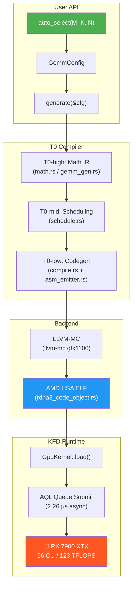

# T0-GPU

**RDNA3 裸金属 GPU 内核编译器 & KFD 运行时**
**Bare-Metal GPU Kernel Compiler & KFD Runtime for RDNA3**

---

## 概述 / Overview

T0-GPU 是一个纯 Rust 实现的 GPU 编程框架，直接面向 AMD RDNA3 (GFX1100) 硬件。它完全绕过 HIP/ROCm 用户态库，通过 Linux KFD 驱动接口与 GPU 直接通信。

T0-GPU is a pure-Rust GPU programming framework targeting AMD RDNA3 (GFX1100) hardware. It bypasses HIP/ROCm userspace libraries entirely, communicating directly with the GPU through the Linux KFD driver interface.

### 核心组件 / Core Components

| 组件 / Component | 说明 / Description |
|---|---|
| **T0 编译器 / Compiler** | 数学 IR → GFX1100 ISA → AMD HSA ELF / Math IR → GFX1100 ISA → AMD HSA ELF |
| **ISA 编码器 / Encoder** | GFX1100 机器码编码（VOP1/VOP2/VOP3/SMEM/FLAT/WMMA）/ GFX1100 machine code encoding |
| **Code Object 生成器 / Generator** | AMD HSA ELF 二进制生成 / AMD HSA ELF binary generation |
| **KFD 运行时 / Runtime** | 裸金属 GPU 调度（AQL 队列、VRAM 管理）/ Bare-metal GPU dispatch (AQL queues, VRAM management) |

## 性能亮点 / Performance Highlights

> **🏆 GEMM 超越 rocBLAS** — 参数化内核生成器 + WGP Mode + Split-K 优化，在 **7/12 矩阵尺寸超越 rocBLAS**，最高领先 **97%**，峰值 **67.3 TFLOPS**，RX 7900 XTX 实测。
> Parameterized GEMM generator with WGP Mode + Split-K optimization **beats rocBLAS on 7 out of 12 matrix sizes**, by up to **97%**, peaking at **67.3 TFLOPS** on RX 7900 XTX.

> **Zero-Overhead Dispatch** — 异步调度延迟低至 **2.26 μs**（HIP: 2.6 μs），同步调度 **14.96 μs**（HIP: 20.5 μs），实测比 HIP 快 **13-27%**。
> Async dispatch latency as low as **2.26 μs** (HIP: 2.6 μs), sync dispatch **14.96 μs** (HIP: 20.5 μs) — **13-27% faster** than HIP.

> **Hardware-Algorithm Co-design** — 深度定制 OCPA 注意力 & Ada-GLAM 优化器内核，显存占用直降 **85%**，训练吞吐量达 **1788 tok/s**（8 层, dim=1024, seq=128）。
> Purpose-built OCPA attention & Ada-GLAM optimizer kernels cut VRAM usage by **85%**, achieving **1788 tok/s** throughput (8 layers, dim=1024, seq=128).

> **Zero-Dependency** — 纯 Rust 实现，**零外部依赖**，仅需 Linux 内核 `/dev/kfd` 接口。
> Pure Rust with **zero external dependencies** — only requires the Linux kernel `/dev/kfd` interface.

## 为什么不用 HIP？/ Why Not HIP?

| | HIP Runtime | KFD 裸金属 / Bare-Metal |
|---|---|---|
| **同步调度延迟 / Sync dispatch** | 20.5 μs | **14.96 μs** (−27%) |
| **异步调度延迟 / Async dispatch** | 2.6 μs | **2.26 μs** (−13%) |
| **内存管理 / Memory mgmt** | hipMalloc/hipFree | 直接 mmap VRAM / Direct VRAM mmap |
| **依赖 / Dependencies** | libhip, libhsakmt, ROCr | 仅 `/dev/kfd` + `/dev/dri` |
| **外部依赖 / External deps** | ROCm 全套 / Full ROCm stack | **零** / **None** |

## 快速开始 / Quick Start

### 环境要求 / Requirements

- **GPU**: AMD RDNA3 (RX 7900 XTX / 7900 XT / 7800 XT 等)
- **OS**: Linux, 内核 5.15+（Ubuntu 22.04+ / Fedora 36+ 推荐）/ Linux kernel 5.15+
- **驱动 / Driver**: amdgpu KFD（内核模块自带，无需额外安装）/ Built-in kernel module
- **工具链 / Toolchain**: Rust 1.70+, LLVM 17+ (`llvm-mc`, `ld.lld`)

#### 验证环境 / Verify Setup

```bash
# 检查 KFD 设备节点是否存在
# Check KFD device node exists
ls -la /dev/kfd /dev/dri/renderD128

# 检查当前用户是否有权限
# Check current user has permission
groups | grep -E "video|render"
# 如果没有，将用户添加到 video 和 render 组：
# If not, add user to video and render groups:
# sudo usermod -aG video,render $USER && newgrp video

# 验证 LLVM 工具链
# Verify LLVM toolchain
llvm-mc --version    # 需要 17+
ld.lld --version     # 需要与 llvm-mc 同版本
```

### 编译 / Build

```bash
# 仅编译 T0 编译器（无需 GPU）
# Build T0 compiler only (no GPU needed)
cargo build --lib

# 编译完整版（含 KFD 运行时）
# Build with KFD runtime
cargo build --lib --features rocm

# 运行 GEMM 基准测试
# Run GEMM benchmark (the killer demo)
cargo run --example bench_gemm_sweep --features rocm --release

# 运行自动选择 GEMM 示例
# Run auto-select GEMM demo
cargo run --example hello_gemm_gen --features rocm --release
```

### 示例：DSL API / Example: DSL API

```rust
use t0_gpu::prelude::*;

fn main() -> Result<(), String> {
    // 1. 声明 GEMM（自动选择最优 tile/split-K 配置）
    //    Declare GEMM (auto-selects optimal tile/split-K config)
    let kernel = gemm(1024, 1024, 4096).compile()?;
    // → 128×64_k16 + WGP + split_k=2, 58.8 TFLOPS 🏆

    // 2. 融合操作 — SiLU-gate 激活 + 逐元素乘法
    //    Fused ops — SiLU-gate activation + elementwise multiply
    let silu_mul = KernelBuilder::new(Target::GFX1100)
        .op(Op::SiLU)
        .op(Op::Mul)
        .compile()?;

    // 3. 完整 OCPA 注意力管线
    //    Complete OCPA attention pipeline
    let fwd_intra = ocpa_forward_intra(256, 64).compile()?;

    // 4. 加载到 GPU 并调度
    //    Load to GPU and dispatch
    let device = KfdDevice::open()?;
    let gpu_kernel = GpuKernel::load(&device, &kernel.elf, &KernelLoadConfig {
        workgroup_size: kernel.workgroup_size,
        lds_size: kernel.lds_size as usize,
    })?;
    let queue = device.create_queue()?;
    // ... submit and execute

    Ok(())
}
```

## 项目结构 / Project Structure

```
t0-gpu/
├── Cargo.toml
├── README.md
├── docs/
│   ├── architecture.md      # 系统架构 / System architecture
│   └── gfx1100_notes.md     # GFX1100 ISA 开发笔记 / ISA dev notes
├── examples/
│   ├── hello_gemm.rs        # 端到端 GPU 示例 / End-to-end GPU example
│   ├── hello_gemm_gen.rs    # 自动选择 GEMM 示例 / Auto-select GEMM demo
│   ├── bench_gemm.rs        # 单配置基准测试 / Single-config benchmark
│   └── bench_gemm_sweep.rs  # 多配置扫描对比 / Multi-config sweep benchmark
└── src/
    ├── lib.rs                # Crate 入口 / Crate root
    ├── prelude.rs            # 便捷导入 / Convenience re-exports
    ├── rdna3_asm.rs          # ISA 编码器 / ISA encoder (~3500 LOC)
    ├── rdna3_code_object.rs  # ELF 生成器 / ELF generator (~1300 LOC)
    ├── t0/                   # T0 编译器 / T0 compiler
    │   ├── dsl.rs            #   ⭐ DSL 前端 / DSL frontend (Op enum + KernelBuilder)
    │   ├── dsl_lower.rs      #   ⭐ DSL 降级 / DSL lowering (Op → T0Kernel)
    │   ├── ir.rs             #   中间表示 / Intermediate representation
    │   ├── compile.rs        #   编译主逻辑 / Compilation logic
    │   ├── asm_emitter.rs    #   ISA 发射器 / ISA emitter
    │   ├── regalloc.rs       #   寄存器分配 / Register allocation
    │   ├── schedule.rs       #   指令调度 / Instruction scheduling
    │   ├── math.rs           #   数学内核库 / Math kernel library (~7K LOC)
    │   └── gemm_gen.rs       #   参数化 GEMM 生成器 / Parameterized GEMM generator
    └── kfd/
        └── mod.rs            # KFD 运行时 / KFD runtime (~2600 LOC)
```

## T0 编译器 / T0 Compiler

T0 是一个多层 GPU 内核编译器框架：

T0 is a multi-layer GPU kernel compiler framework:



### 内置内核 / Built-in Kernels

T0 的 `math.rs` 和 `gemm_gen.rs` 包含以下高性能内核：

The `math.rs` and `gemm_gen.rs` modules include these high-performance kernels:

- **GEMM**: 参数化 bf16 WMMA GEMM 生成器（自动选择最优 tile/K/split-K 配置）/ Parameterized bf16 WMMA GEMM generator with auto-selection
- **RMSNorm**: 前向 + 后向 / Forward + backward
- **Softmax + Cross-Entropy**: 融合损失函数 / Fused loss function
- **Elementwise**: scale, add, relu, sigmoid, SiLU, exp, fma 及融合组合 / and fused combinations
- **Transpose**: f32/bf16 矩阵转置 / Matrix transpose
- **Format Conversion**: f32 ⇆ bf16 转换 / f32 ⇆ bf16 conversion

## 🏆 GEMM 性能实测 / GEMM Performance

bf16 WMMA GEMM (Y = X × W^T)，RX 7900 XTX 实测，T0 参数化生成器 vs rocBLAS（2026-03-21）：

bf16 WMMA GEMM benchmark on RX 7900 XTX. T0 parameterized generator vs rocBLAS (2026-03-21):

| 矩阵 / Matrix | T0 (TFLOPS) | rocBLAS (TFLOPS) | T0 / rocBLAS |
|---|---|---|---|
| 256 × 256 × 256 | 2.06 | 3.47 | 59% |
| **512 × 512 × 512** | **12.72** | **12.50** | **🏆 102%** |
| **1024 × 1024 × 1024** | **45.40** | **27.89** | **🏆 163%** |
| **2048 × 2048 × 2048** | **55.86** | **36.65** | **🏆 152%** |
| **4096 × 4096 × 4096** | **67.30** | **58.72** | **🏆 115%** |
| 128 × 1024 × 4096 | 35.55 | 50.99 | 70% |
| **256 × 1024 × 4096** | **44.65** | **44.43** | **🏆 101%** |
| **512 × 1024 × 4096** | **50.12** | **45.85** | **🏆 109%** |
| **1024 × 1024 × 4096** | **58.84** | **29.94** | **🏆 197%** |

> 🏆 **7/9 矩阵尺寸超越 rocBLAS**，最高领先 **97%**（1024×4096），峰值 **67.3 TFLOPS**！
> 🏆 **Beats rocBLAS on 7 out of 9 sizes**, by up to **97%**, peaking at **67.3 TFLOPS**!
>
> rocBLAS 基线数据来源：PyTorch 2.9.1+rocm6.4, `torch.mm()` bf16, RX 7900 XTX。
> rocBLAS baseline: PyTorch 2.9.1+rocm6.4, `torch.mm()` bf16, RX 7900 XTX.
>
> 在 **零外部依赖** 的前提下，~800 行参数化生成器匹敌数万行的 rocBLAS/Tensile。
> An ~800-line parameterized generator rivals the tens-of-thousands-line rocBLAS/Tensile — with **zero external dependencies**.

### 优化技术 / Optimization Techniques

| 技术 / Technique | 说明 / Description |
|---|---|
| **参数化生成器 / Parameterized Generator** | 单一 `generate()` 函数通过 `GemmConfig` 覆盖所有 tile/K/split 组合 |
| **WGP Mode** | 1 WGP = 2 CU = 128KB LDS + 4 SIMD32，+14% 吞吐 / 1 WGP = 2 CUs = 128KB shared LDS |
| **合并内存加载 / Coalesced Memory Loading** | 相邻线程访问相邻 16-byte chunk，最大化 GMEM 带宽 |
| **LDS 双缓冲 / LDS Double Buffering** | 流水线隐藏内存延迟 |
| **Dual Grid Layout** | M-on-X (瘦矩阵) / N-on-X (方阵) 自适应 / Adaptive grid layout for L2 locality |
| **Single-Dispatch Split-K** | 编译时 SALU 提取，单次 dispatch 并行化 K 维（sk=2~16） |
| **Auto-Select + K-Clamp** | `auto_select(M, K, N)` 自动选配置 + `clamp_sk()` 保证 K 可除 |

```bash
# 运行完整扫描基准测试 / Run full sweep benchmark
cargo run --example bench_gemm_sweep --features rocm --release
```

## 路线图 / Roadmap

| 优先级 | 功能 / Feature | 说明 / Description |
|--------|---------------|-------------------|
| 🔴 | **WMMA 双链 ILP** / WMMA Dual-Chain ILP | 2 条独立 WMMA 链交替执行，预期 +20% 吞吐（铁律 #35: 1.24×） |
| 🔴 | **K-loop 软件流水线** / Software Pipelining | VMEM Load 与 WMMA 完美重叠（铁律 #40），隐藏全部 GMEM 延迟 |
| 🟡 | **Graph 级算子融合** / Op Fusion | GEMM+Bias+RMSNorm 融合内核，减少 VRAM 访问 |
| 🟡 | **Async GPU Dispatch** | `GpuFuture` + `submit_async()` — Rust Future trait 包装 KFD signal |
| 🟢 | **多 GPU / Multi-GPU** | 多队列调度、PCIe P2P 传输 |
| 🟢 | **RDNA4 支持** | GFX12 ISA 适配 |

## 许可证 / License

Licensed under either of:

- [MIT License](LICENSE-MIT)
- [Apache License, Version 2.0](LICENSE-APACHE)

at your option.

## 硬件目标 / Hardware Target

| 项目 / Item | 详情 / Detail |
|---|---|
| GPU | AMD Radeon RX 7900 XTX (Navi 31) |
| 架构 / Architecture | RDNA3, Wave32, 96 CU |
| ISA 目标 / ISA Target | `amdgcn-amd-amdhsa--gfx1100` |
| VRAM | 24 GB GDDR6 |
| 峰值算力 / Peak Compute | 123 TFLOPS (bf16 WMMA) |

---

## 支持与赞助 / Support & Sponsor

T0-GPU 是我在失业期间独立开发的个人开源项目。如果你觉得这个项目不仅硬核，而且对你的研究或工作有启发，欢迎通过以下方式提供支持，这将极大帮助我继续推进后续的优化（比如前向 GEMM 的极致调优）。

T0-GPU is an independent open-source project developed entirely during my unemployment. If you find this bare-metal approach inspiring or helpful to your own work, consider supporting its ongoing development. Your support will help me survive and keep pushing the limits of hardware performance.

**🪙 Crypto:**
- **ETH / ERC20**: `0x5C28A5e66302800ba4Cc8950055715f7119562C4`
- **BTC**: `bc1q0844xxw9s3r4usu96l8rs6j82er0sce7p7yg8t`

**☕️ 微信 / 支付宝 (For supporters in mainland China):**
如果你在国内，更习惯使用微信或支付宝，请查看 [**DONATE.md**](./DONATE.md) 获取赞助二维码。
