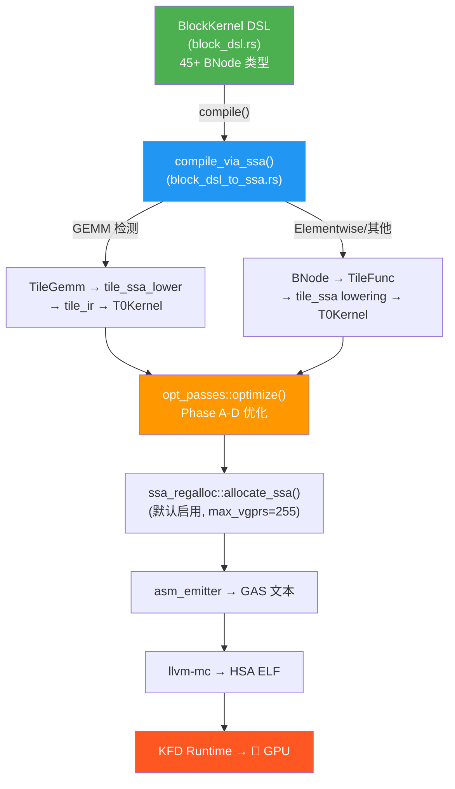

# T0 编译器全脉络审计（代码验证版 v4）

> **初版日期**: 2026-03-25  
> **更新日期**: 2026-03-26  
> **审计方法**: 全部源码逐行验证  
> **权威代码源**: `src/OCPA/opensource/` (独立 crate `t0-gpu`)  
> **当前开发重心**: T0 编译器本身（Ignis 开发已暂停）

---

## 一、编译管线真实状态

> [!IMPORTANT]
> **`compile()` 已委派给 `compile_via_ssa()`** — [block_dsl.rs:911-912](file:///home/geis/tprime_optimized/rust-port/tprime-brain/src/OCPA/opensource/src/t0/block_dsl.rs#L911-L912)
> ```rust
> pub fn compile(&self, target: Target) -> Result<CompiledKernel, String> {
>     self.compile_via_ssa(target)
> }
> ```
> **所有代码（包括 Ignis）已全部走 SSA 管线**。`compile_legacy()` 已删除。

### 统一编译管线数据流



### 优化管线详情 (opt_level=4, 默认)

| Phase | Pass | 状态 | 关键修复 |
|-------|------|------|---------|
| **A** | SSA Lift + CopyProp + CSE + LICM + ConstFold | ✅ | CSE: barrier-aware + inline 常量编码 + MVal 哨兵值过滤；LICM: insert 位置修复（terminator 前） |
| **A** | lower_from_ssa VReg remap | ✅ | 重构为 `mval_to_vreg` + `rename_op_uses/defs`（所有 SSA pass 的基础） |
| **B** | Loop Unroll + Strength Reduce | ✅ | 无已知问题 |
| **C** | AlgSimp + DCE（迭代） | ✅ | DCE: loop-carried liveness fix（Step 2b，backward branch 检测） |
| **C** | Load/Store Coalescing | ✅ | 无已知问题 |
| **D** | Waitcnt Optimization | ✅ | 运行在 MachFunc 上，移除冗余 waitcnt |
| **D** | Post-Regalloc Scheduling | ✅ | **post-regalloc**——物理 VReg 依赖分析（RAW/WAW/WAR + VCC/SCC），避免 pre-regalloc 与 regalloc 不兼容 |

> [!NOTE]
> `opt_level` 分级：0=无优化, 1=Phase A, 2=A+B, 3=A+B+C, 4=全部（默认）。
> 通过 `k.set_opt_level(N)` 或 `T0_OPT_LEVEL=N` 环境变量控制。
> GEMM tile_ir 使用 opt_level=4。

### math.rs 的位置

`math.rs`（70+ 预定义内核模板）概念上**已被 BlockKernel DSL 替代**，但由于 Ignis 和多处引用，当前不能移除。它是**被冻结的遗留依赖**。

---

## 二、功能代码验证

| 功能 | 在 BNode 枚举 | SSA compile_via_ssa | 验证证据 |
|------|:-----------:|:------------------:|---------:|
| **IfMask/ElseMask/EndIf** | ✅ | ✅ ExecMask 三段式 | `block_dsl_to_ssa.rs` |
| **ForAccBegin/Phi/End/Result** | ✅ | ✅ 完整翻译 | `block_dsl_to_ssa.rs` |
| **TensorLayout** | — | ✅ 5 变体 | `tile_ssa.rs` |
| **predict_best → auto_select** | — | ✅ 已连接 | `gemm_gen.rs` |
| **SSA RegAlloc + Spill** | — | ✅ 默认启用 | `compile.rs` |
| **DomTree + CSE/LICM** | — | ✅ | `domtree.rs` + `opt_passes.rs` |

> [!TIP]
> **所有 BNode 功能已 100% 覆盖 SSA 路径**。
> `compile_legacy()` 及老管线已于 2026-03-25 清理删除。

---

## 三、三层重复结构

| 层 | 位置 | 定位 |
|----|------|------|
| **Layer A** | `src/` | 宿主——T0 旧简化版、rdna3 副本、rdna3_runtime(唯一) |
| **Layer B** | `src/OCPA/` | OCPA 子项目——rdna3 副本、Ignis 旧版、训练代码 |
| **Layer C ✅** | `src/OCPA/opensource/` | 权威代码源——T0 完整版(28文件)、Ignis 最新版、KFD 独立版 |

---

## 四、KFD 运行时安全机制

| 防御层 | 机制 | 文件 |
|--------|------|------|
| SIGPIPE 忽略 | `signal(13, SIG_IGN)` 防止管道杀进程 | `kfd/mod.rs` |
| KFD open 重试 | 5 次重试，覆盖 MODE1 reset 恢复窗口 | `kfd/mod.rs` |
| GPU 健康探针 | GTT buffer 写入→读回验证 | `kfd/mod.rs` |

---

## 五、测试覆盖

GEMM tile_ir test suite: **9/9 PASS**（opt_level=4）
- 1024³: err=9.92e-5, **14.73 TF**
- deterministic: err=3.81e-6（5 runs 完全一致）

---

## 六、已解决的关键问题（2026-03-25~26）

| 问题 | 根因 | 修复 | 影响 |
|------|------|------|------|
| GPU 硬挂（6次/天） | LICM insert 位置 + Shr raw_asm | `insert(len-1)` + 缓存 `rhs_val_precheck` | 消除硬挂 |
| SSA regalloc 冲突 | max_vgprs=128 + MVal 多对一映射 | max_vgprs=255 + MVal interval 合并 | 冲突 26→0 |
| CSE 错误结果/hang | 5 个根因（key 不完整、barrier 不清空等） | 全面修复 | err=inf→3.81e-6 |
| DCE err=12.3 | loop-carried deps 无 phi 节点 | backward branch → root-live | DCE 正确启用 |
| Scheduling err=22.4 | pre-regalloc 与 regalloc 不兼容 | post-regalloc scheduling | Sched 正确启用 |

---

## 七、当前短板与后续方向

| 方向 | 状态 |
|------|------|
| SSA scheduling（SWP） | 未触发（tile_gemm 有 LDS → 安全跳过），逻辑未验证 |
| 边界 masking（非 tile 对齐矩阵） | 缺失 |
| 64×64 tile 精度 | 有问题（cooperative load 地址计算可能不正确） |
| Ignis → BlockKernel DSL 迁移 | 未开始 |
| Layer A/B 重复文件清理 | 未开始 |
| math.rs 退役 | 等 Ignis 迁移完成 |