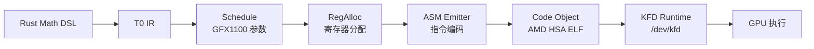

# T0 系统架构

## 编译流水线



## 模块依赖

```
                    ┌──────────────────────────────────┐
                    │          用户代码                  │
                    │  fn my_kernel() -> T0Kernel       │
                    └──────────┬───────────────────────┘
                               │
                    ┌──────────▼───────────────────────┐
                    │         t0::math                  │
                    │  预定义算子: GEMM, softmax, etc.    │
                    │  用户可组合新算子                    │
                    └──────────┬───────────────────────┘
                               │
                    ┌──────────▼───────────────────────┐
                    │         t0::ir                    │
                    │  类型化 IR: Op, Value, Block       │
                    │  支持: f32, bf16, i32, vec4        │
                    └──────────┬───────────────────────┘
                               │
              ┌────────────────┼─────────────────┐
              │                │                 │
    ┌─────────▼────┐  ┌───────▼──────┐  ┌───────▼──────┐
    │ t0::schedule │  │ t0::regalloc │  │ t0::compile  │
    │ 硬件参数:     │  │ 虚拟→物理寄存器│  │ IR→ISA 编译  │
    │ Wave32       │  │ 溢出处理      │  │ 指令选择      │
    │ 96 CU        │  │              │  │ 控制流        │
    │ WMMA 16x16   │  │              │  │              │
    └──────────────┘  └──────────────┘  └──────┬───────┘
                                               │
                                    ┌──────────▼───────┐
                                    │  rdna3_asm.rs    │
                                    │  GFX1100 ISA 编码 │
                                    │  VOP1/2/3, SMEM  │
                                    │  Global, WMMA    │
                                    └──────────┬───────┘
                                               │
                                    ┌──────────▼───────┐
                                    │  rdna3_code_obj  │
                                    │  AMD HSA ELF 生成 │
                                    │  .hsaco binary   │
                                    └──────────┬───────┘
                                               │
                           ┌───────────────────▼───────────────────┐
                           │           KFD Runtime                 │
                           │  ┌──────────┐ ┌─────────┐ ┌────────┐ │
                           │  │KfdDevice │ │AqlQueue │ │GpuBuf  │ │
                           │  │ VRAM     │ │ AQL pkt │ │ mmap   │ │
                           │  │ /dev/kfd │ │ doorbell│ │ r/w    │ │
                           │  └──────────┘ └─────────┘ └────────┘ │
                           └───────────────────────────────────────┘
```

## T0 IR 示例

T0 IR 是一个类型化的数学表示层：

```rust
// IR 操作类型
enum Op {
    Load { addr: Value, width: Width },      // 全局内存加载
    Store { addr: Value, data: Value },      // 全局内存存储
    Add(Value, Value),                       // 标量加法
    Mul(Value, Value),                       // 标量乘法
    WMMA { a: VReg, b: VReg, c: VReg },     // 矩阵乘加
    ThreadIdx,                               // 线程 ID
    WorkgroupIdx,                            // 工作组 ID
    // ...
}
```

## KFD 调度模型

```
CPU                              GPU
 │                                │
 │ 1. pool.write_kernargs(ka)     │
 │    ↓ (写入 GTT 内存)            │
 │ 2. queue.submit(kernel, grid)  │
 │    ↓ (写 AQL packet to ring)   │
 │ 3. doorbell write              │
 │    ↓ (通知 CP/MEC)             │
 │ 4. return (~1μs)               │  ← CP 开始执行
 │    ...                         │  ← GPU 计算中
 │ 5. queue.wait_idle()           │  ← 等待完成
 │    ↓                           │
 │ 6. 读结果                       │
```

## 关键设计决策

1. **直接生成机器码** — 不经过 LLVM IR/bitcode，T0 直接输出 GFX1100 ISA 编码
2. **编译时寄存器分配** — 虚拟寄存器在编译期映射到物理 VGPR/SGPR
3. **零 LDS GEMM** — WMMA 直接从全局内存加载 fragment，不使用 LDS 暂存
4. **KFD 裸金属** — 绕过 HIP/ROCm 用户态栈，直接与硬件队列交互
